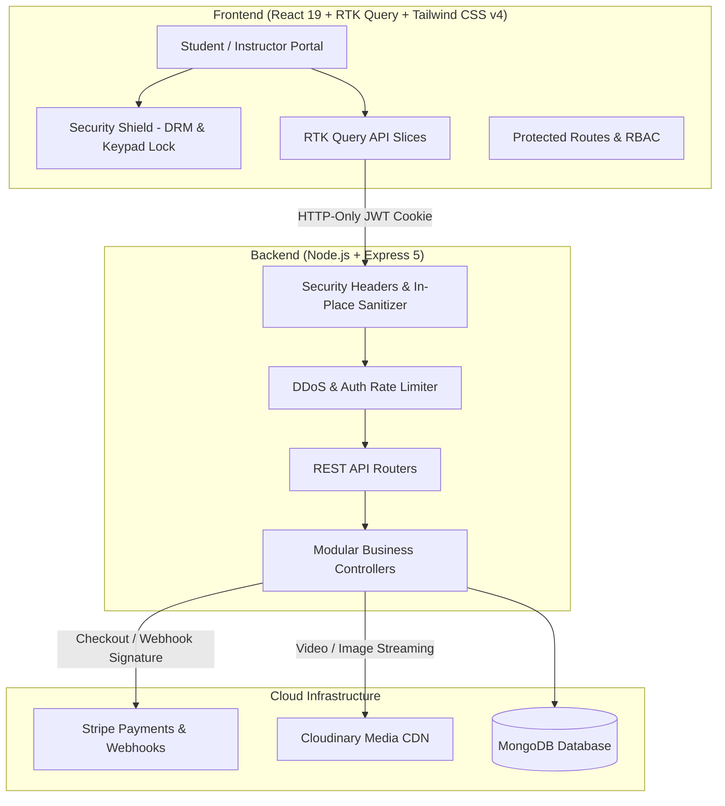

# 🎓 SkillStack LMS — Enterprise Full-Stack Learning Management System

[](https://github.com/SandeepCodes31/SkillStack/stargazers)
[](https://opensource.org/licenses/ISC)
[](https://react.dev/)
[](https://nodejs.org/)
[](https://expressjs.com/)
[](https://www.mongodb.com/)
[](https://tailwindcss.com/)
[](https://stripe.com/)
[](https://cloudinary.com/)

> **SkillStack LMS** is an enterprise-grade, production-ready Learning Management System engineered from scratch for scalable digital education. The platform features dual role-based workflows (Student and Instructor/Admin), Cloudinary-powered adaptive video streaming, automated course progression tracking, assessment quizzes with auto-grading, cryptographically verifiable PDF certificates with scannable QR codes, gamified daily learning streaks, Stripe Checkout with idempotent HMAC webhook verification, and a military-grade client and server security suite.

Designed and developed from scratch by **[Sandeep Pal](https://github.com/SandeepCodes31/)**.

- 🌐 **Project Repository**: [https://github.com/SandeepCodes31/SkillStack.git](https://github.com/SandeepCodes31/SkillStack.git)
- 👤 **Author's GitHub Profile**: [https://github.com/SandeepCodes31/](https://github.com/SandeepCodes31/)

---

## 📑 Table of Contents

- [✨ Comprehensive Feature Breakdown](#-comprehensive-feature-breakdown)
  - [👨‍🎓 Student Experience & Learning Journey](#-student-experience--learning-journey)
  - [👨‍🏫 Instructor & Admin Operations](#-instructor--admin-operations)
  - [🛡️ Enterprise Security Suite & DRM Protection](#️-enterprise-security-suite--drm-protection)
- [🛠️ Deep-Dive Tech Stack Architecture](#️-deep-dive-tech-stack-architecture)
  - [1. Authentication & Security (JWT & Bcrypt)](#1-authentication--security-jwt--bcrypt)
  - [2. Payment Gateway Architecture (Stripe & Webhooks)](#2-payment-gateway-architecture-stripe--webhooks)
  - [3. Database Modeling (MongoDB & Mongoose 9)](#3-database-modeling-mongodb--mongoose-9)
  - [4. Media & Video Streaming Pipeline (Cloudinary & Multer)](#4-media--video-streaming-pipeline-cloudinary--multer)
  - [5. Document Generation Engine (PDFKit & QRCode)](#5-document-generation-engine-pdfkit--qrcode)
  - [6. Frontend State Management (Redux Toolkit & RTK Query)](#6-frontend-state-management-redux-toolkit--rtk-query)
  - [7. UI System & Design Tokens](#7-ui-system--design-tokens)
- [🏗️ System Architecture & Workflow](#️-system-architecture--workflow)
- [📂 Complete Project Directory Structure](#-complete-project-directory-structure)
- [⚙️ Environment Variables Reference](#️-environment-variables-reference)
- [🚀 Quick Start & Installation Guide](#-quick-start--installation-guide)
- [📡 Complete REST API Reference](#-complete-rest-api-reference)
- [👨‍💻 Author & Attribution](#-author--attribution)
- [📄 License](#-license)

---

## ✨ Comprehensive Feature Breakdown

### 👨‍🎓 Student Experience & Learning Journey

1. **Context-Aware Adaptive Hero Section**:
   - **Guest / Unauthenticated View**: Automatically hides personalized progress counters to prevent artificial mock data. Displays an interactive tech stack badge showcase (React, Python, Node, AI/ML, Cloud Architecture), student collaboration visuals, platform statistics, and quick-start actions.
   - **Authenticated View**: Dynamically pulls the student's live enrolled course, real completion percentage bar, module counters, live fire streak (`🔥`), and verified credentials count with direct "Resume Lesson" navigation.
2. **Course Discovery & Intelligent Search**:
   - Real-time multi-criteria filtering by category (Web Development, Frontend, Backend, DevOps, AI/ML), difficulty level (Beginner, Intermediate, Advanced), and price sorting.
   - Homepage Featured Courses section strictly displays the **6 latest published courses** (`slice(0, 6)`) sorted by newest first, automatically cycling older courses into the full searchable catalog.
3. **Interactive Course Detail & Syllabus Preview**:
   - Dark glassmorphic hero header showcasing course level, student enrollment count, star ratings, and instructor credentials.
   - *"What You'll Learn & Build"* structured learning outcomes.
   - Interactive lecture syllabus with duration badges, locked indicators, and instant free video previews.
   - Sticky pricing & checkout card (`lg:sticky lg:top-24`) featuring course preview video, 30-day money-back guarantee badge, and one-click URL sharing.
4. **Video Learning & Lecture Progress Tracking**:
   - Built-in video player with auto-saved playback progress.
   - Sequential module unlocking with instant database synchronization on completion.
5. **End-of-Course Assessment Quizzes**:
   - Quizzes automatically unlocked when 100% of course lectures are completed.
   - Timed multiple-choice assessment with automated scoring, question randomized display, and pass/fail thresholds.
6. **Cryptographically Verifiable PDF Certificates with QR Codes**:
   - Automatic certificate issuance upon successfully passing the course assessment quiz.
   - High-resolution printable PDF vector certificates generated server-side using `pdfkit`.
   - Embedded QR code linking directly to a public cryptographic verification route (`/verify-certificate/:certificateId`).
7. **Gamified Daily Learning Streaks**:
   - Logs daily learning activities to encourage habit formation.
   - Real-time tracking of current streak, longest streak, activity calendar, and streak freeze protections.
8. **Student Financial History & Invoicing**:
   - Transaction logs with instant PDF receipt downloads generated server-side.
   - Profile management with custom avatar upload via Cloudinary.

---

### 👨‍🏫 Instructor & Admin Operations

1. **Instructor Onboarding & Verification**:
   - Dedicated instructor registration interface with management review and verification checks.
2. **Financial & Analytics Dashboard**:
   - Interactive revenue charts and enrollment trends powered by `recharts`.
   - Real-time metric cards for Total Earnings, Active Students, Published Courses, and Sale Conversion Rates.
3. **Comprehensive Course Creation & Editor**:
   - Multi-step course creation workflow with rich text descriptions (`Quill` / `Jodit`).
   - Cloudinary thumbnail upload with automated image optimization.
   - Instant draft vs. publish toggle.
4. **Curriculum & Lecture Builder**:
   - Direct video upload pipeline supporting large media files with Cloudinary integration.
   - Free preview toggle on individual lectures to increase student conversion.
   - Lecture reordering, updating, and deletion.
5. **Quiz Creator & Question Bank**:
   - Attach customized assessment quizzes to any published course.
   - Add, edit, and organize multiple-choice questions with customized passing score thresholds.
6. **Payment & Transaction Audit**:
   - Real-time monitoring of student transactions, Stripe session IDs, amounts, currencies, and settlement statuses.

---

### 🛡️ Enterprise Security Suite & DRM Protection

1. **Anti-Screenshot & Screen Capture Protection**:
   - Active keyboard interception for `PrintScreen`, Windows Snipping Tool (`Win + Shift + S`, `Alt + PrintScreen`), macOS capture keys (`Cmd + Shift + 3 / 4 / 5`), print dialogs (`Ctrl + P`), and page saving (`Ctrl + S`).
   - Automatically purges/overwrites the clipboard with a security message (`"⚠️ Content protected by SkillStack Security."`).
   - Flashes a momentary full-screen protection shield overlay with a copyright alert upon capture attempts.
   - `@media print { html, body { display: none !important; } }` blanks out any attempted browser printouts.
2. **Copy, Cut, and Paste Lock**:
   - Global `contextmenu` listener blocks right-clicking across the entire application, preventing "Inspect Element" and "Save image as...".
   - `copy` and `cut` events are locked across all pages, triggering a security alert toast.
   - Global `-webkit-user-select: none; user-select: none;` prevents text scraping, enabling selection exclusively inside designated input fields.
   - Intercepts DevTools shortcuts: `F12`, `Ctrl + Shift + I/J/C`, `Ctrl + U` (View Source).
3. **Photo & Media Download Protection**:
   - Blocks drag-and-drop actions on images (`-webkit-user-drag: none !important; user-drag: none !important;`).
   - Images are shielded from browser context-saving and direct download attempts.
4. **Intelligent Keypad Lock with Security Policy Warning**:
   - Locks arbitrary keyboard typing on pages, cards, and reading materials to protect against scraping shortcuts.
   - Typing is strictly enabled only in authorized input zones:
     - **Course Search**: Hero search, CourseSearchSection, SearchPage filter inputs (`data-search-input="true"`).
     - **Contact Section**: The newly created interactive **Contact Support Modal** (`data-contact-input="true"`).
     - **Authentication & Core Forms**: Login, signup, and administrative forms so users and instructors can enter their credentials and manage courses without lockouts.
   - Any typing attempt outside these zones triggers a security warning toast:
     > *"🔒 Keypad is locked for security purposes. Typing is enabled only in the search and contact sections."*
5. **Server-Side Security Suite (`security.js`)**:
   - **Security HTTP Headers**: `X-Content-Type-Options: nosniff`, `X-Frame-Options: DENY`, `X-XSS-Protection: 1; mode=block`, `Referrer-Policy: strict-origin-when-cross-origin`, HSTS, and removal of `X-Powered-By`.
   - **Express 5 In-Place NoSQL Injection Guard**: Sanitizes incoming query and body payloads, stripping dangerous MongoDB operators (`$gt`, `$where`, etc.) without interfering with Express 5 getters.
   - **DDoS & Anti-Brute-Force Rate Limiting**: In-memory IP-based rate limiting protecting sensitive auth routes (`/api/v1/user/login`, `/api/v1/user/register`) and general API traffic.
   - **Payload Size Limits**: Strict 10MB limits on JSON and URL-encoded bodies to prevent buffer overflow and memory starvation attacks.
   - **Environment-Driven Centralized API Architecture**: All RTK Query slices utilize `VITE_API_BASE_URL` with automatic environment fallbacks, eliminating hardcoded hostnames for seamless local and production deployments.

---

## 🛠️ Deep-Dive Tech Stack Architecture

### 1. Authentication & Security (JWT & Bcrypt)
- **Password Hashing with Bcrypt.js**:
  Passwords are never stored in plaintext. When a user registers, `bcrypt.hash(password, 10)` generates a salted cryptographic hash with 10 salt rounds. During authentication, `bcrypt.compare()` compares the plaintext candidate against the stored hash in constant time to thwart timing attacks.
- **Stateless JWT Token Issuance**:
  Upon successful authentication, the server generates a JSON Web Token signed with `process.env.SECRET_KEY` containing the user's `userId` and `role`.
- **HTTP-Only Cookie Delivery**:
  The JWT is transmitted via an `httpOnly`, `sameSite: "lax"`, and `maxAge: 24 * 60 * 60 * 1000` cookie. Because HTTP-Only cookies cannot be accessed via JavaScript (`document.cookie`), the application is completely safeguarded against Cross-Site Scripting (XSS) token exfiltration.

### 2. Payment Gateway Architecture (Stripe & Webhooks)
- **Stripe Hosted Checkout Sessions**:
  When a student clicks "Purchase Course", the backend creates a Stripe Checkout session with line items, course metadata, and return URLs (`/course-progress/:courseId?session_id={CHECKOUT_SESSION_ID}` or `/payment-cancel`).
- **Raw-Buffer HMAC Webhook Verification**:
  To protect against fraudulent enrollment attempts, the Stripe webhook route (`/api/v1/purchase/webhook`) is mounted **before** `express.json()` using `express.raw({ type: "application/json" })`. It validates the `stripe-signature` header against `process.env.STRIPE_WEBHOOK_SECRET` using `stripe.webhooks.constructEvent()`.
- **Idempotency & Double-Charge Protection**:
  The fulfillment service checks MongoDB for existing records with the corresponding `paymentId` or `sessionId` prior to modifying balances or enrolling students, guaranteeing that duplicate webhook deliveries never cause inconsistent database states.

### 3. Database Modeling (MongoDB & Mongoose 9)
The persistence layer is structured with strict Mongoose schemas:
- `User`: Manages identity, salted credentials, role (`student` | `instructor` | `admin`), verification flag, and enrolled courses array.
- `Course`: Stores course metadata, pricing, category, level, instructor reference, lectures array, and published status.
- `Lecture`: Stores individual video URLs, Cloudinary public IDs, lecture titles, duration, and free-preview flag.
- `CourseProgress`: Maps a student's progress for a specific course, maintaining an array of watched lecture IDs and an overall completion boolean.
- `CoursePurchase`: Financial transaction audit ledger storing payment ID, amount, currency, status, receipt number, and user/course references.
- `Quiz` & `QuizAttempt`: Assessment schema storing multiple-choice question arrays, answer keys, passing score thresholds, student attempt scores, and pass/fail states.
- `Certificate`: Stores unique certificate IDs, recipient reference, course reference, issue date, verification hash, and PDF download links.
- `LearningStreak` & `LearningActivity`: Maintains daily activity timestamps, streak counters, and freeze statuses.

### 4. Media & Video Streaming Pipeline (Cloudinary & Multer)
- **Multipart Form Processing**: Uses `multer` with memory storage buffers for uploading course thumbnails and video lectures.
- **Adaptive Video Delivery**: Uploads directly to Cloudinary with `resource_type: "auto"` or `"video"`, leveraging Cloudinary's global CDN, automatic HLS/MP4 transcoding, and bitrate optimization.
- **Automated Media Cleanup**: When a course thumbnail or lecture is updated or deleted, the server triggers `cloudinary.uploader.destroy()` using the asset's `publicId` to prevent orphaned cloud storage bloat.

### 5. Document Generation Engine (PDFKit & QRCode)
- **Server-Side Vector PDF Invoices**:
  Financial invoices are rendered on-the-fly using `pdfkit`, drawing institutional headers, student details, line items, transaction numbers, and settlement timestamps directly into a streaming binary response.
- **Cryptographically Verifiable Certificates**:
  Certificates are drawn with decorative vector borders, gold seals, and typography. A cryptographic QR code generated via `qrcode` is embedded into the canvas, directing smartphones and scanners directly to the live verification endpoint.

### 6. Frontend State Management (Redux Toolkit & RTK Query)
- **Normalized RTK Query API Slices**:
  API requests are isolated into specialized slices: `authApi`, `courseApi`, `courseProgressApi`, `purchaseApi`, `quizApi`, `certificateApi`, and `streakApi`.
- **Automated Cache Invalidation**:
  Uses RTK Query tags (`User`, `Refetch_Creator_Course`, `Refetch_Lecture`) to automatically synchronize UI components across the screen when lectures or courses are updated without requiring manual page reloads.
- **Centralized API Config**:
  All slices import from `src/config/api.config.js`, pointing dynamically to `import.meta.env.VITE_API_BASE_URL`.

### 7. UI System & Design Tokens
- **React 19 & Tailwind CSS v4**: Built with the latest React 19 component patterns and Tailwind CSS v4 utility classes.
- **Zero-Shift Dropdown Architecture**: Radix UI dialogs and dropdowns configured with `modal={false}` and CSS `scrollbar-gutter: stable;` to eliminate horizontal layout jerking on Windows browsers.
- **Fluid Dark / Light Mode**: Dynamic color theming powered by `next-themes` and CSS variables.

---

## 🏗️ System Architecture & Workflow



---

## 📂 Complete Project Directory Structure

```text
SkillStack/
├── client/                           # React 19 Frontend Application
│   ├── public/                       # Static brand assets and logos
│   ├── src/
│   │   ├── app/                      # Redux store & root reducer configuration
│   │   │   ├── store.js
│   │   │   └── rootReducer.js
│   │   ├── assets/                   # Partner logos, images, and brand graphics
│   │   ├── components/               # Reusable atomic & domain components
│   │   │   ├── ui/                   # Shadcn / Radix UI atomic primitives
│   │   │   ├── landing/              # Modular landing page sections
│   │   │   ├── streak/               # Daily streak tracker widgets
│   │   │   ├── Navbar.jsx            # Stable responsive navigation bar
│   │   │   ├── Footer.jsx            # Modern footer with creator attribution
│   │   │   ├── SecurityShield.jsx    # Screenshot, copy/paste & keypad DRM shield
│   │   │   ├── ContactModal.jsx      # Interactive support modal (unlocked typing)
│   │   │   ├── BuyCourseButton.jsx   # Stripe checkout action button
│   │   │   ├── CertificateModal.jsx  # Certificate viewer & PDF downloader
│   │   │   ├── ReceiptModal.jsx      # Payment receipt viewer & downloader
│   │   │   └── ProtectedRoutes.jsx   # Role-based route protection
│   │   ├── config/                   # Centralized application configuration
│   │   │   └── api.config.js         # Environment-driven API endpoints
│   │   ├── features/api/             # RTK Query API endpoints
│   │   │   ├── authApi.js            # User authentication & profile endpoints
│   │   │   ├── courseApi.js          # Course CRUD & catalogue endpoints
│   │   │   ├── courseProgressApi.js  # Lecture progression & status endpoints
│   │   │   ├── purchaseApi.js        # Checkout, orders & payment endpoints
│   │   │   ├── quizApi.js            # Assessment quiz queries & mutations
│   │   │   ├── certificateApi.js     # Certificate generation & verification
│   │   │   └── streakApi.js          # Daily streak & activity endpoints
│   │   ├── pages/                    # Main application route views
│   │   │   ├── admin/                # Instructor & Admin dashboard pages
│   │   │   │   ├── course/           # Course table & lecture builders
│   │   │   │   ├── quiz/             # Quiz management & question editor
│   │   │   │   ├── certificate/      # Credential audit dashboards
│   │   │   │   └── payment/          # Transaction logs & analytics
│   │   │   └── student/              # Student learning pages
│   │   │       ├── HeroSection.jsx   # Adaptive guest / user hero banner
│   │   │       ├── CourseDetail.jsx  # Modern course preview & sticky purchase
│   │   │       ├── CourseProgress.jsx# Video player & curriculum tracker
│   │   │       ├── StudentDashboard.jsx # Student portal & credentials
│   │   │       └── VerifyCertificate.jsx # Public QR certificate verifier
│   │   ├── App.jsx                   # React Router DOM v7 route definitions
│   │   ├── App.css                   # Print lockout, text-select & DRM styling
│   │   └── main.jsx                  # Application entry point
│   ├── .env.example                  # Client environment template
│   ├── package.json
│   └── vite.config.js
│
├── server/                           # Express 5 Backend API
│   ├── controllers/                  # Business logic handlers
│   │   ├── user.controllers.js       # Auth, profiles & verification
│   │   ├── course.controllers.js     # Courses, lectures & publishing
│   │   ├── courseProgress.controller.js # Video progress & completions
│   │   ├── coursePurchase.controller.js # Stripe sessions & webhooks
│   │   ├── quiz.controller.js        # Quiz submissions & grading
│   │   ├── certificate.controller.js # PDF generation & QR validation
│   │   └── streak.controller.js      # Daily streak calculation
│   ├── database/                     # MongoDB Mongoose connection
│   │   └── db.js
│   ├── middlewares/                  # Auth validation & security filters
│   │   ├── isAuthenticated.js        # JWT cookie verification middleware
│   │   └── security.js               # Headers, in-place sanitizer & rate limiter
│   ├── models/                       # Mongoose database schemas
│   │   ├── user.model.js
│   │   ├── course.model.js
│   │   ├── lecture.model.js
│   │   ├── courseProgress.js
│   │   ├── coursePurchase.model.js
│   │   ├── quiz.model.js
│   │   ├── quizAttempt.model.js
│   │   ├── certificate.model.js
│   │   └── learningStreak.model.js
│   ├── routes/                       # Express REST API routes
│   │   ├── user.route.js
│   │   ├── course.route.js
│   │   ├── purchaseCourse.route.js
│   │   ├── courseProgress.route.js
│   │   ├── quiz.route.js
│   │   ├── certificate.route.js
│   │   ├── streak.route.js
│   │   └── media.route.js
│   ├── utils/                        # Cloudinary, PDFKit, QR & token utilities
│   │   ├── cloudinary.js
│   │   ├── certificatePdf.js
│   │   └── generateToken.js
│   ├── .env                          # Server environment configuration
│   ├── package.json
│   └── index.js                      # Server startup & middleware pipeline
│
└── README.md                         # Project documentation
```

---

## ⚙️ Environment Variables Reference

### 1. Server Environment (`server/.env`)

```env
# Server Runtime
PORT=8080
NODE_ENV=development

# MongoDB Connection
MONGO_URI=mongodb+srv://<username>:<password>@cluster0.mongodb.net/lms?retryWrites=true&w=majority

# JWT Token Secret
SECRET_KEY=your_super_secret_jwt_key_here_minimum_32_characters

# Cloudinary Media CDN
CLOUD_NAME=your_cloudinary_cloud_name
API_KEY=your_cloudinary_api_key
API_SECRET=your_cloudinary_api_secret

# Stripe Payments Configuration
STRIPE_SECRET_KEY=sk_test_51...your_stripe_secret_key
STRIPE_PUBLISHABLE_KEY=pk_test_51...your_stripe_publishable_key
WEBHOOK_ENDPOINT_SECRET=whsec_...your_stripe_webhook_secret

# Client Application URL
FRONTEND_URL=http://localhost:5173
```

### 2. Client Environment (`client/.env`)

```env
# API Base Endpoint
VITE_API_BASE_URL=http://localhost:8080
```

---

## 🚀 Quick Start & Installation Guide

### Prerequisites
- **Node.js** (v20.0.0 or higher recommended)
- **npm** (v10.0.0 or higher)
- **MongoDB** Atlas account or local MongoDB instance
- **Cloudinary** account (for media hosting)
- **Stripe** developer account (for test payments)

### Step 1: Clone the Repository
```bash
git clone https://github.com/SandeepCodes31/SkillStack.git
cd SkillStack
```

### Step 2: Configure & Start the Server
```bash
# Navigate to backend
cd server

# Install dependencies
npm install

# Start development server
npm run dev
```
*The server will start listening on `http://localhost:8080`.*

### Step 3: Configure & Start the Client
Open a second terminal window:
```bash
# Navigate to frontend
cd client

# Install dependencies
npm install

# Start Vite client
npm run dev
```
*The client application will open on `http://localhost:5173`.*

### Step 4 (Optional): Stripe Webhook Forwarding
To test instant payment settlement locally:
```bash
stripe login
stripe listen --forward-to localhost:8080/api/v1/purchase/webhook
```
Copy the webhook signing secret output by the Stripe CLI into your `server/.env` as `WEBHOOK_ENDPOINT_SECRET`.

---

## 📡 Complete REST API Reference

### 🔐 Authentication & Users (`/api/v1/user`)
| Method | Endpoint | Description | Access |
| :--- | :--- | :--- | :--- |
| `POST` | `/register` | Register new student or request instructor account | Public |
| `POST` | `/login` | Authenticate credentials & issue HTTP-Only JWT | Public |
| `GET` | `/logout` | Invalidate session & clear auth cookie | Authenticated |
| `GET` | `/profile` | Fetch authenticated user profile & enrolled courses | Authenticated |
| `PUT` | `/profile/update` | Update name, bio & avatar (Multer/Cloudinary) | Authenticated |

### 📚 Course Management (`/api/v1/course`)
| Method | Endpoint | Description | Access |
| :--- | :--- | :--- | :--- |
| `GET` | `/published-courses` | Retrieve all public published courses | Public |
| `GET` | `/search` | Multi-filter query search (category, level, price) | Public |
| `GET` | `/:courseId` | Get course details and free-preview lectures | Public |
| `POST` | `/` | Initialize new course draft | Instructor |
| `PUT` | `/:courseId` | Update course details, syllabus, & publish state | Instructor |
| `POST` | `/:courseId/lecture` | Upload and attach video lecture | Instructor |

### 💳 Purchases & Payments (`/api/v1/purchase`)
| Method | Endpoint | Description | Access |
| :--- | :--- | :--- | :--- |
| `POST` | `/checkout/create-checkout-session` | Initialize Stripe hosted checkout session | Student |
| `POST` | `/webhook` | Stripe HMAC signed raw-buffer webhook listener | Stripe |
| `GET` | `/course/:courseId/detail-with-status` | Verify enrollment and purchase status | Authenticated |
| `GET` | `/receipt/:purchaseId/pdf` | Stream downloadable PDF payment invoice | Student |

### 📈 Course Progress (`/api/v1/progress`)
| Method | Endpoint | Description | Access |
| :--- | :--- | :--- | :--- |
| `GET` | `/:courseId` | Fetch completed lectures & percentage progress | Student |
| `POST` | `/:courseId/lecture/:lectureId/view` | Mark individual lecture as watched | Student |
| `POST` | `/:courseId/complete` | Mark entire course completed | Student |

### 🎯 Quizzes & Assessments (`/api/v1/quiz`)
| Method | Endpoint | Description | Access |
| :--- | :--- | :--- | :--- |
| `GET` | `/course/:courseId` | Fetch course assessment questions | Student |
| `POST` | `/course/:courseId/submit` | Submit answers & receive evaluated score | Student |
| `POST` | `/` | Create or update course assessment quiz | Instructor |

### 📜 Verified Certificates (`/api/v1/certificate`)
| Method | Endpoint | Description | Access |
| :--- | :--- | :--- | :--- |
| `GET` | `/my-certificates` | Retrieve all earned certificates | Student |
| `GET` | `/verify/:certificateId` | Public cryptographic validation endpoint | Public |
| `GET` | `/:certificateId/pdf` | Stream downloadable vector PDF certificate | Student |

### 🔥 Learning Streaks (`/api/v1/streak`)
| Method | Endpoint | Description | Access |
| :--- | :--- | :--- | :--- |
| `GET` | `/my-streak` | Retrieve current streak, fire status & calendar | Student |
| `POST` | `/record-activity` | Record daily learning session activity | Student |

---

## 👨‍💻 Author & Attribution

SkillStack LMS was designed and built from scratch by:

### **Sandeep Pal**
- 🐙 **Personal GitHub**: [https://github.com/SandeepCodes31/](https://github.com/SandeepCodes31/)
- 📦 **Repository**: [https://github.com/SandeepCodes31/SkillStack.git](https://github.com/SandeepCodes31/SkillStack.git)

⭐ **If you find this project helpful or inspiring, please give it a star on GitHub!**

---

## 📄 License

This project is licensed under the **ISC License**. Feel free to use and adapt it for learning and portfolio purposes.
